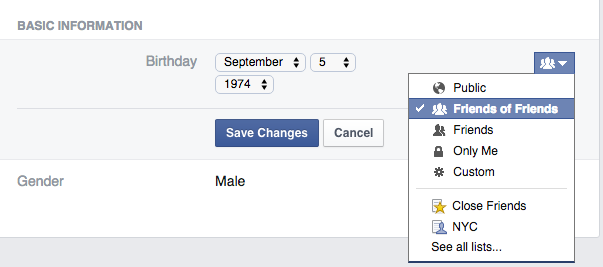

# How to control access to your personal details?
## Controlling access to your personal details
Learn about controlling access to your personal details on social networking sites.

## Learn how to
- [Be careful in posting personal information to social networking sites](en/topics/practice-4-safe-social-networks/2-access-personal-details/3-learn.md)
- [Control access to personal information on your Facebook profile](en/topics/practice-4-safe-social-networks/2-access-personal-details/4-howto.md)

## What to post to social networking sites
# Be careful with what information you give
Social networking sites ask you for a good deal of data about yourself to make it easier for other users to find and connect to you.
 
# Identity fraud is common
Perhaps the biggest vulnerability this creates for users of these sites is the possibility of identity fraud, which is increasingly common.
 
# Less is more
The more information about yourself you reveal online, the easier it becomes for the authorities to identify you and monitor your activities.
 
# Posts can impact your family
The online activities of diaspora activists from some countries have led to the targeting of their family members by the authorities in their homelands.
 
# Do you need to post
Before posting, think about whether it's necessary to post:
 - birth dates
 - contact phone numbers
 - addresses
 
# Do you need to post
 - details of family members
 - sexual orientation
 - education and employment history

## Scenario
Mansour and Magda are human rights defenders from north Africa. They are organising a march, to take place in the middle of a large city. They want to use Facebook to publicise the event. They are worried that the authorities could be tipped off and that anyone who shows an interest could be traced. They plan to use Twitter during the march to give updates on the progress of the march. But what if the police could monitor the tweets, and deploy squads to intercept marchers? Mansour and Magda plan how to share photos and videos of the march without revealing people's identities, because they worry that participants could face persecution.

## Control access to personal information on your Facebook profile
You can control who can see various elements of your profile. This doesn't happen in the main privacy settings but directly when editing your profile.
 
Go to About > Contact & Basic Info you can see your date of birth:

 
If you place your mouse cursor over it, you will see an icon which can be a globe (public), a group (friends of friends), a lock (only me) or possibly other images.

 
Clicking on this icon will bring up a menu where you can change this setting:

## Test you social networking knowledge!

## Next
If you found this section useful, you might be interested in the following sections:
- [Getting started with Social Networks](en/topics/practice-4-safe-social-networks/0-getting-started/1-intro-hrd.md)
- [Controlling access to friends & contacts](en/topics/practice-4-safe-social-networks/1-access-friends-contacts/1-intro.md)
 
- [Learing to chat securely](en/topics/practice-4-safe-social-networks/3-facebook-chat/1-intro.md)
- [Who controls and owns your information on Social Networking platforms?](en/topics/practice-4-safe-social-networks/4-who-controls/1-intro.md)
- [Who can access your information on Social Networking platforms?](en/topics/practice-4-safe-social-networks/5-who-can-access/1-intro.md)

