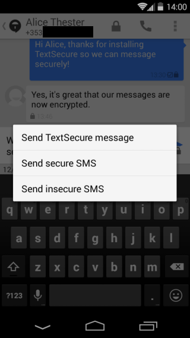

## Messaging Individuals

# Step 1: Open Signal
Open Signal and tap at the top of your screen to bring up your contact list.
 
# Step 2: Select contact
Tap on the contact you wish to message.
 
**Note:** The contact list will display at the top all your contacts who also use Signal (under the Signal Users heading) and then your full contact list (including Signal users) in the All Contacts section.
 

> Figure 1: Signal contact list

 
# Step 3: Write your message
Compose your message in the box and tap to send.
 
**Note:** If you send a message to another Signal user and you are connected to the Internet, the default option is to send it via Internet.
 

> Sent message

 
If you want to send an encrypted SMS (using your mobile phone company) or an insecure SMS instead of an encrypted message long press to bring up the alternative sending options.
 

> Alternative sending options

 
# Things You Should Know
Your sent messages are given different background colours / indicators to help you identify how they were sent:
 
# Encrypted via Internet
Blue with a icon: The message was sent encrypted via Internet.
 

> Encrypted message send via mobile data

 
# Encrypted SMS
Green with a icon: The message was sent as an encrypted SMS.
 

> Encrypted SMS

 
# Insecure SMS
Green: The message was sent as an insecure SMS.
 

> Insecure SMS

 
# Delivery notification
A icon in your message indicates that it has been delivered.
 
**Note:** this only appears by default when messages are sent via Internet; to see them when sending SMS you need to enable SMS delivery report in settings.
 
**Note:** The messages you receive from your contact will always be grey. If they have a icon, they were received encrypted. If there is no icon **the message was received insecurely.**

