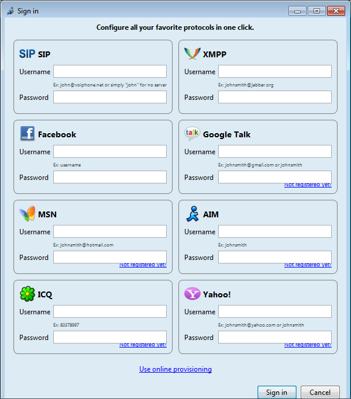
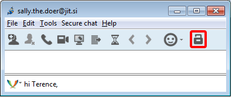
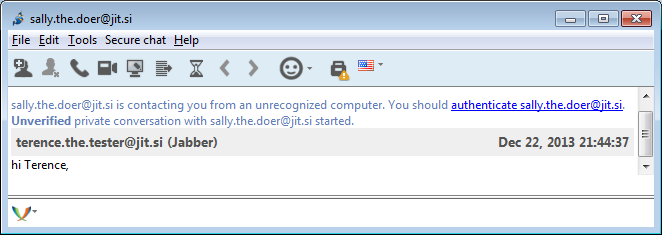
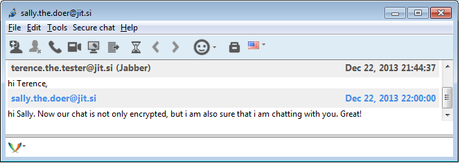
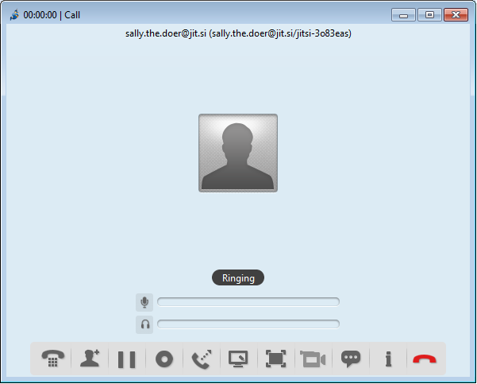

# How to chat securely?
## Communicate securely on Facebook

Learn to encrypt your Facebook voice calls and instant messages.

## Learn how to

- [Understand Facebook communication basics](en/topics/practice-4-safe-social-networks/3-facebook-chat/3-learn.md)
- [Install the messaging application Jitsi](en/topics/practice-4-safe-social-networks/3-facebook-chat/4-2-howto.md)
- [Add your Facebook account on Jitsi](en/topics/practice-4-safe-social-networks/3-facebook-chat/4-3-howto.md)
- [Encrypt your Facebook instant messages](en/topics/practice-4-safe-social-networks/3-facebook-chat/4-4-howto.md)
- [Encrypt your Facebook voice calls](en/topics/practice-4-safe-social-networks/3-facebook-chat/4-5-howto.md)

## A safe conversation...

Brenda and Isaac are journalists communicating via Facebook. They know that law enforcement agencies are able to intercept their Facebook messages because they are unencrypted.
 
They need to learn how to encrypt their communication. If they don't, they worry the content of their communications will be used against them.

## Facebook communication basics

# Encryption is safe
You can easily enhance the privacy and security of your Facebook communications by using encryption.
 
# Unencrypted communication is dangerous
When you communicate over Facebook without the use of encryption, the company and all other third parties it potentially shares your data with (including other advertising companies and law enforcement agencies) can have access to the content of your instant messages (IM) and voice calls (VoIP).
 
# Protect your network
Not only can insecure communication potentially expose your data to beach, but also that of your contacts.
 
# Use Jitsi
To enhance the privacy and security of your communications, you can install Jitsi: a client which supports the Off-the-Record (OTR) protocol for IM encryption and ZRTP for VoIP encryption.
 
# Protect the content of your conversations
OTR clients like Jitsi not only makes the content of your communications inaccessible to various third parties, such as governments and corporations, it also makes it inaccessible to Facebook.

## Installing Jitsi in 7 steps

# Step 1: Download Jitsi
Download Jitsi through its [website](https://jitsi.org/Main/Download).
 
# Step 2: Open Jitsi
 Double click on the downloaded Jitsi file; the Open File - Security Warning dialogue box might appear. If it does, click on *"Run"* to activate the Windows Installer screen, followed by the *"Welcome to the Jitsi Setup Wizard"* window.
 
# Step 3: Agree to End User License Agreement
Click on **"Next"** to activate the "End User License Agreement" window; **check** the "I accept the terms in the License Agreement" option to enable the *Next* button, and then click on **"Next"** to activate the "Destination Folder" window.
 
# Step 4: Activate "Additional Tasks"
Click on **"Next"** to activate the "Additional Tasks" window and accept the default settings as presented.
 
**Note:** Enabling the Auto-start when computer restarts or reboots option may slow down the overall function of your computer, especially if you already have multiple applications configured to run when your computer starts up.
 
# Step 5: Install Jitsi
Click on **"Next"** to activate the "Ready to Install Jitsi" window, and then click on **"Install"** to activate the "Installing Jitsi" window displaying the installation progress bar.
 
# Step 6: Finish installation
Click on **"Finish"** to complete the installation process and automatically launch the "Jitsi Sign in" window as follows:

 
**Note:** In some instances, installing and launching Jitsi for the first time triggers a Windows Security Alert prompt screen. This alert is normal behaviour for the MS Windows operating system, it is ok to continue with using Jitsi.
 
Even if you do not click on any of the buttons, and simply close the prompt window, Jitsi is still able to communicate through Facebook Chat.

 
# Step 7: Authorise Jitsi
Select both Private and Public networks check-boxes, and then click Allow access to see the Jitsi Sign in window or main user interface window.

## Adding a Facebook account on Jitsi

# Two settings to change
Facebook has two settings that you might need to change before Jitsi can connect to your Facebook Chat.
 
# Facebook Username
Facebook requires a username for Jitsi to connect to Facebook chat. Many Facebook users already have a username.
 
# Check your username
To check your username, log in to your Facebook account: your username is what appears in the location bar of your browser after https://www.facebook.com/ when you view your Timeline or Page.
 
# Other places you can find your username
Your username is also included in your Facebook email address (e.g. username@facebook.com).
 
# Other places you can find your username
You can get a new Facebook username by going to your Account Settings > General section or by visiting https://www.facebook.com/username.
 
# Verify your Facebook account
To set a new username Facebook might want to verify your account, which might require sending an SMS to a mobile phone number which you will need to provide to Facebook in the verification process.
 
# More questions?
For more details see Facebook’s explanation of usernames.
 
# App Settings
Facebook’s “application platform” needs to be turned on before Jitsi can connect to Facebook Chat.
 
# Turn "Apps you use" on
Visit your Facebook Account Settings > Apps section and check that the setting for “Apps you use” is turned “On”.
 
**Note:** Turning Facebook’s "application platform" on opens up much of your Facebook data to third-party application developers.
 
This data is available not only to the Facebook applications that you use, but also to the Facebook applications used by any of your friends.
 
# Hide personal information
After turning on Facebook’s "application platform", be sure to check the settings under "Apps others use". This allows you to hide some personal information from applications used by your friends.
 
# No setting for total privacy
Unfortunately, Facebook does not offer settings to hide all personal information.
 
# Determine privacy trade-off
Certain categories of information (like your friend list, gender, or info you have made public) are visible as long as Facebook’s "application platform" is turned "on". It is up to you to determine whether this is an acceptable trade-off.
 
# Add your Facebook account
Now you are prepared to add your Facebook account on Jitsi. To do this follow the steps below:
 
# Step 1: Add new Jitsi account
Select **File > Add New Account...** in the main menu bar of Jitsi.
 
# Step 2: Add new Facebook account
In the "Add New Account" dialogue, *Network* menu choose Facebook, enter your username and password and Click **"Add"**.

## Encrypting your Facebook instant messages

# Step 1: Open security settings
Select **Tools > Options** from the Jitsi menu and subsequently select the **Security** tab and its **Chat** sub-tab. You will then see a window similar to one shown in the image below:

 
# Step 2: Generate a key
Click on the **"Generate"** button. As a result you will see the fingerprint of the key that has been generated:

 
# One key per account
One key is generated for each account. You only need to do this again if you add a new account or install Jitsi on another device and do not move the existing keys to it.
 
# You are now ready to communicate
 
# Step 3: Open a new chat
Select a contact from the Jitsi main window and click on the *send message icon* (first from the left under the contact's name) to open a text chat window:

 
# Know when your chats are encrypted
Note the Encrypt chat with OTR icon, the open padlock on the right-top side of the window. This inconspicuous symbol informs you whether the chat is encrypted or not. Now the lock is open (there is a tiny space between handle and the body of the lock!).
 
# Step 4: Encrypt the chat
Click on the Encrypt chat with OTR icon. Note the changes in the window:

 
# Encryption is now on
Observe that the padlock is now locked. This means that whatever messages you and your contact send to each other are encrypted. Note the message that this is an unverified private conversation and that you should authenticate your contact.
 
# Step 5: Authenticate contact
Click on the link authenticate sally.the.doer@jit.si to open the Authenticate Buddy window:

 
# Compare your fingerprints
Note the message that encourages you to compare the fingerprints of vyour keys with your contact over another channel (not this text chat). In doing this, you can be more certain that you are communicating with your contact and not somebody else.
 
# Do so face to face
A good choice for key comparisons is to do it face to face, or via video or voice communication as these provide easier means to authenticate the identity of the other person.
 
# Verify the fingerprint
After you compare fingerprints, select the option I have verified the fingerprint from the pull-down menu and click on Authenticate Buddy:

 
# Return to chat
Closing the Authenticate Buddy window returns you to the chat window:

 
# Authentication verified
Note that padlock no longer includes the orange triangle with the white exclamation mark. This means that you have authenticated your contact.
 
# Only verify once per contact
The authentication should be done only once per contact. If the triangle with exclamation mark returns, it means that you are chatting to somebody who you have not yet authenticated.
 
# Re-authenticate contacts
This can happen when your contact moves to another device with another encryption key (another installation of Jitsi, or another OTR enabled program, etc.). In this case you will need to re-authenticate each other again to be sure of the identity of person with whom you communicate.

## Encrypting Facebook voice calls

# Using Jitsi
Jitsi offers voice and video chats which can be independently encrypted with open standard called ZRTP.
 
# Step 1: Select your contact
Click on the contact in Jitsi contact list and click on the voice (second icon from the left under the contact's name) or video (third) icon - see figure 5 above. A new window will appear indicating that Jitsi is establishing the connection:

 
# Receive a call notification
Your contact will see incoming call notification:

 
# Step 2: Accept the call
If your contact accepts the call you will receive information that you are connected:

 
**Note the red open padlock.** This means that your call is not yet encrypted with ZRTP.
 
# Step 3: wait
Wait... Your and your contact's programs are establishing an encrypted connection, which may take a moment.
 
# Determine if encrypted or not
If they succeed you will see the letters zrtp appear against an orange backgrond with a closed padlock like below. If they don't succeed in establishing a connection, you still can chat but without encryption
 
# Call again if problem encrypting
You can disconnect, restart Jitsi and try again to see if this time the programs will connect with encryption. ZRTP may not work in calls between accounts from different providers (such as between Google and Jit.si).

 
# Step 4:: Confirm encryption
Observe the section under the letters zrtp and padlock with the message "Compare with partner" followed by 4 characters.
 
# Verify four characters
Read these letters to your contact and ask if she sees the same characters. If she does, it means that your communication is encrypted and nobody is interfering with it.
 
# Confirm call is encrypted
You can click Confirm. The orange zrtp field will turn green:

 
# Step 5: Close confirmation box
You may close the black confirmation section of the window by clicking on the white x sign on upper-right part of the black section:

 
# Encrypted group calls
Jitsi lets you voice and video chat with more than one person. Note that with this communication, ZRTP encryption can be engaged between initiator of the call and other parties, but not between parties themselves.

## Test you social networking knowledge!

 See also:
- Tactical Technology Collective: [Security in a Box](https://securityinabox.org)

