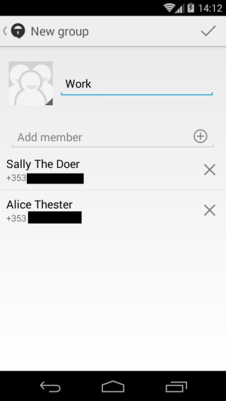
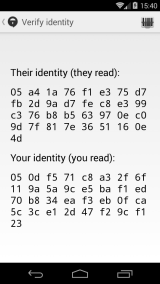
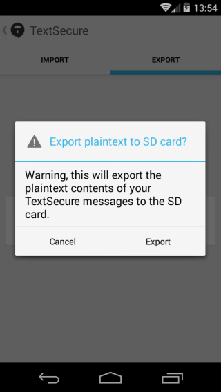

# Messaging
## Send files

# Basics
Signal allows you to send images, video and audio files to your contact.
 
# Step 1: Start a conversation
Start a conversation with the person you want to send the file to.
 
# Step 2:
Tap the top right of your screen to bring up the menu and select "Add attachment"
 

> File type selection

# Step 3: Select the type of file
Choose from the list the type of file that you want to send - Picture / Video / Audio
 

> Image sent to contact

# Step 4: Select the file
Select the file you want to send.
 
# Step 5: Verify the file
Verify that the file you want to send is in the compose window and press to send.

## Send and Receive messages

# You and your contact need Signal installed
To send encrypted messages to your contacts, they must also have Signal installed, otherwise the message will be sent as an insecure SMS.
 
# Sending via SMS
Signal can send messages as SMS using your mobile phone company to relay the message. With this option, even if your recipient is using Signal and the SMS is encrypted, your mobile phone company will know that you are sending a (encrypted) message to this particular recipient.
 
# Sending via the Internet
If your phone is connected to the Internet, either using a data connection offered by your mobile phone company or using local wifi, Signal will instead send the message over an encrypted connection with a WhisperSync server.
 
# Protecting your privacy
In this instance, your mobile phone company will not know who you are sending your messages to.

## Message Individuals

# Step 1: Open Signal
Open Signal and tap at the top of your screen to bring up your contact list.
 
# Step 2: Select contact
Tap on the contact you wish to message.
 
**Note:** The contact list will display at the top all your contacts who also use Signal (under the Signal Users heading) and then your full contact list (including Signal users) in the All Contacts section.
 

> Figure 1: Signal contact list

 
# Step 3: Write your message
Compose your message in the box and tap to send.
 
**Note:** If you send a message to another Signal user and you are connected to the Internet, the default option is to send it via Internet.
 

> Sent message

 
If you want to send an encrypted SMS (using your mobile phone company) or an insecure SMS instead of an encrypted message long press to bring up the alternative sending options.
 

> Alternative sending options

 
# Things You Should Know
Your sent messages are given different background colours / indicators to help you identify how they were sent:
 
# Encrypted via Internet
Blue with a icon: The message was sent encrypted via Internet.
 

> Encrypted message send via mobile data

 
# Encrypted SMS
Green with a icon: The message was sent as an encrypted SMS.
 

> Encrypted SMS

 
# Insecure SMS
Green: The message was sent as an insecure SMS.
 

> Insecure SMS

 
# Delivery notification
A icon in your message indicates that it has been delivered.
 
**Note:** this only appears by default when messages are sent via Internet; to see them when sending SMS you need to enable SMS delivery report in settings.
 
**Note:** The messages you receive from your contact will always be grey. If they have a icon, they were received encrypted. If there is no icon **the message was received insecurely.**

## Message groups

# Basics
Signal also allows you to message multiple people at once.
 
**Note:** If at least one of the people you are messaging does not use Signal, the messages will be sent as an MMS and not encrypted.
 
# Step 1: Create new group
Tap on the top right of your screen to bring up the menu and select "New group"
 
# Step 2: Name your group
Enter a name for your chat group and tap "+" to add your contacts.
 
# Step 3: Add contacts
Tap the box to the right of each contacts name to add them to the group and press the check mark
 

> Contact selection

 

> Group Creation

 
# Step 4: Complete group creation
Tap the checkmark to complete the creation of the group and be brought back to the Signal main screen.
 
# Step 5: Start messaging
Tap on the group you have created and begin messaging the group.
 

> Group conversation

## Read fingerprints

# Basics
To confirm that the messages you are sending and receiving are with the right person, you should both verify your Signal identities with each other by verifying fingerprints.
 
# Step 1: Open existing conversation
Open an existing conversation with your contact and tap at the top of the screen.
 
# Step 2: Verify identity
Tap "Verify Identity" from the pull-down menu.
 
# Step 3: Find fingerprint
You will be presented with a 66-character fingerprint of your Signal identity and that of your contacts.
 

> Signal fingerprints

 
# Step 4: Read fingerprint
Verify that you both have the same fingerprints for each other, either in person or via a medium that allows you to confirm visually or audibly to whom you are talking.

## Scan fingerprints

**Note:** To verify fingerprints by scanning you need to have Barcode Scanner installed on your phone. If it is not available on your phone at the time of scanning Signal will download and install the app for you.
 
# Step 1: Open existing conversation
Open an existing conversation with your contact and tap at the top of the screen.
 
# Step 2: Verify identity
Tap "Verify identity" from the pull-down menu.
 
# Step 3: Find fingerprint
You will be presented with a 66-character fingerprint of your Signal identity and that of your contacts.
 
# Step 4: Click on barcode
On both your phones tap on .
 
# Step 5: Prepare to scan
On your phone tap "Scan your key to compare" and your contact should tap "Get my key scanned". Your contact's phone will display a QR code and your phone will open Barcode Scanner.
 

> Your contact's QR code

 
# Step 6: Scan QR code
Use Barcode Scanner on your phone to scan your contact's QR code.
 

> Barcode scanner

 
# Step 7: Check that identity is valid
Once the QR code has been successfully scanned Signal will check that the identity is valid.
 

> Signal identity verified

 
# Step 8: Repeat to verify yours
Once you have verified your contact's Signal identity, they should repeat the above steps to verify yours.
 

## Export your messages

**Note:** While Signal allows you to export your messages, the messages in the backup file will not be encrypted and you should take additional steps to protect its contents.
 
# Step 1:
Tap on the top right of the main Signal screen to bring up the menu and select "Import/Export"
 
# Step 2: Select
 The next screen will open on the import options, tap "Export"
 
# Step 3:
On the export screen tap "Export plaintext backup"
 

> Signal export

# Step 4:
Confirm that you want to export the unencrypted messages to the storage on your phone by tapping "Export"
 
# Step 5:
Signal will confirm the export has completed by displaying "Success!" You will find a file called Textsecure.xml on your phone's storage that contains your unencrypted messages.
 

> Export confirmation screens

## Use Signal for encrypted messaging

Learn to use Signal for encrypted messaging.

## Learn how to

- [Send and receive messages](topics/tool-2-signal/1-messaging/index.html#-1-sending-and-receiving-messages)
- [Message Individuals](topics/tool-2-signal/1-messaging/index.html#-2-messaging-individuals)
- [Message Groups](topics/tool-2-signal/1-messaging/index.html#-3-messaging-groups)
- [Send files](topics/tool-2-signal/1-messaging/index.html#-4-sending-files)
- [Verify identities](topics/tool-2-signal/1-messaging/index.html#-5-identity-verification)
- [Read and scan fingerprints](topics/tool-2-signal/1-messaging/index.html#-6-reading-fingerprints)
- [Export your messages](topics/tool-2-signal/1-messaging/index.html#-8-export-your-messages)

## Share

## Next

If you found this useful, you might be interested in reading the following units:
 - [Install Signal on your smart phone and encrypting messages](topics/tool-2-signal/0-getting-started/4-howto-install.md)
 - [Make encrypted voice calls to other Signal users.](topics/tool-2-signal/2-voice/1-intro.md)

