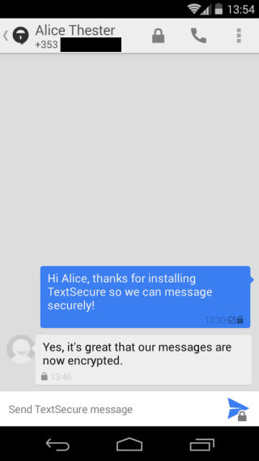
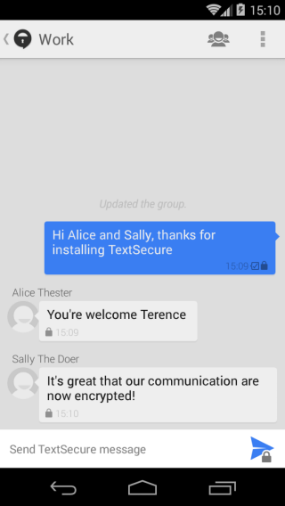
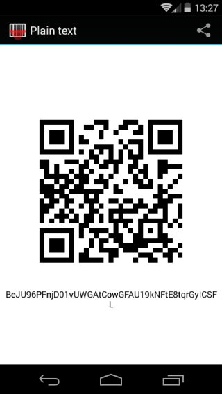

# How to use messaging?
## How to share Open Mentoring content with others?

<!--is this a broken link?-->

* First you need to share the app.
 * Then you need to share content.

[Learn more about risk types and levels](resources/risk-assessment.md)

## Scenario

Mansour is an investigative journalist who wants to share the app with his source Magda who has a sensitive story about government corruption. She wants to enable Magda to communicate safely and share documents. He needs to be careful to share the app and its content in ways that doesn't allow to link them together to protect Magda as a source.

## How-to
First you need to share the app
 * If you want to share this app as a link 
 * If you want to share the app with a QR code

Then you need to share the content
 * ...

## How-to
First you need to share the app
 * If you want to share this app as a link 
 * If you want to share the app with a QR code

Then you need to share the content
 * ...

## How-to
Below are the steps that you will take to send and receive encrypted text using Signal:

- Sending and Receiving messages
- Messaging Individuals
- Messaging Groups
- Identity Verification
- Reading Fingerprints
- Scanning Fingerprints
- Export your messages

##  **[1] Sending and Receiving messages**

**Note:** To send encrypted messages to your contacts, they must also have Signal installed, otherwise the message will be sent as an insecure SMS.

Signal can send messages as SMS using your mobile phone company to relay the message. With this option, even if your recipient is using Signal and the SMS is encrypted, your mobile phone company will know that you are sending a (encrypted) message to this particular recipient. 

If your phone is connected to the Internet, either using a data connection offered by your mobile phone company or using local wifi, Signal will instead send the message over an encrypted connection with a WhisperSync server. In this instance, your mobile phone company will not know who you are sending your messages to.

## **[2] Messaging Individuals**

**Step 1:** Open Signal and tap at the top of your screen to bring up your contact list.

**Step 2:** Tap on the contact you wish to message.

Note: The contact list will display at the top all your contacts who also use Signal (under the Signal Users heading) and then your full contact list (including Signal users) in the All Contacts section.

Figure 1: Signal contact list

**Step 3:** Compose your message in the box and tap to send.

Note If you send a message to another Signal user and you are connected to the Internet, the default option is to send it via Internet. If you want to send an encrypted SMS (using your mobile phone company) or an insecure SMS instead of an encrypted message long press to bring up the alternative sending options.

Figure 2 & 3: Sent message / Alternative sending options

## _Things You Should Know_

Your sent messages are given different background colours / indicators to help you identify how they were sent:

Blue with a icon: The message was sent encrypted via Internet.

Figure 4: Encrypted message send via mobile data

Green with a icon: The message was sent as an encrypted SMS.

Figure 5: Encrypted SMS

Green: The message was sent as an insecure SMS.

Figure 6: Insecure SMS

A icon in your message indicates that it has been delivered. Note: the only appears by default when messages are sent via Internet; to see them when sending SMS you need to enable SMS delivery report in settings.

The messages you receive from your contact will always be grey. If they have a icon, they were received encrypted. If there is no icon **the message was received insecurely.**

## **[3] Messaging Groups**

Signal also allows you to message multiple people at once.

Note: If at least one of the people you are messaging does not use Signal, the messages will be sent as an MMS and not encrypted.

**Step 1:** Tap on in the top right of your screen to bring up the menu and select 

**Step 2:** Enter a name for your chat group and tap to add your contacts.

**Step 3:** Tap the box to the right of each contacts name to add them to the group and press.

Figure 7 & 8: Contact selection & Group Creation

**Step 4:** Tap to complete the creation of the group and be brought back to the Signal main screen.

**Step 5:** Tap on the group you have created and begin messaging the group.

Figure 9: Group conversation

## [4] Sending Files

Signal allows you to send images, video and audio files to your contact.

**Step 1:** Start a conversation with the person you want to send the file to.

**Step 2:** Tap on in the top right of your screen to bring up the menu and select .

**Step 3:** Choose from the list the type of file that you want to send - Picture / Video / Audio

**Step 4:** Select the file you want to send.

**Step 5:** Verify that the file you want to send is in the compose window and press to send.

Figure 10 & 11: File type selection / Image sent to contact

## [5] Identity Verification

To confirm that the messages you are sending and receiving are with the right person, you should both verify your Signal identities with each other.

## [6] Reading Fingerprints
The Following steps will need to be performed by both parties.

**Step 1:** Open an existing conversation with your contact and tap at the top of the screen.

**Step 2:** Tap from the pull-down menu.

**Step 3:**You will be presented with a 66-character fingerprint of your Signal identity and that of your contacts. These should be read to each other, and verify that you both have the same fingerprints for each other, either in person or via a medium that allows you to confirm visually or audibly to whom you are talking.

Figure 12: Signal fingerprints

## [7] Scanning Fingerprints

**Note:** To verify fingerprints by scanning you need to have Barcode Scanner installed on your phone. If it is not available on your phone at the time of scanning Signal will download and install the app for you.

The Following steps will need to be performed by both parties.

**Step 1:** Open an existing conversation with your contact and tap at the top of the screen.

**Step 2:** Tap from the pull-down menu.

**Step 3:** You will be presented with a 66-character fingerprint of your Signal identity and that of your contacts.

**Step 4:** On both your phones tap on .

**Step 5:** On your phone tap and your contact should tap . Your contact's phone will display a QR code and your phone will open Barcode Scanner.

**Step 6:** Use Barcode Scanner on your phone to scan your contact's QR code.

Figure 13 & 14: Your contact's QR code / Barcode scanner

**Step 7:** Once the QR code has been successfully scanned Signal will check that the identity is valid.

Figure 15: Signal identity verified

**Step 8:** Once you have verified your contact's Signal identity, they should repeat the above steps to verify yours.

## [8] Export your messages
Note: While Signal allows you to export your messages, the messages in the backup file will not be encrypted and you should take additional steps to protect its contents.

**Step 1:** Tap on in the top right of the main Signal screen to bring up the menu and select .

**Step 2:** The next screen will open on the import options, tap .

**Step 3:** On the export screen tap .

**Step 4:** Confirm that you want to export the unencrypted messages to the storage on your phone by tapping .

**Step 5:** Signal will confirm the export has completed by displaying . You will find a file called Textsecure.xml on your phone's storage that contains your unencrypted messages.

Figure 16 & 17: Signal Export and Export confirmation screens

## Share

## Share

