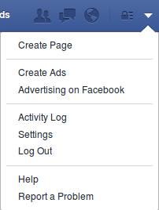
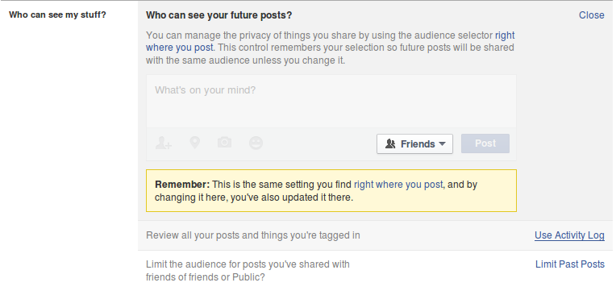
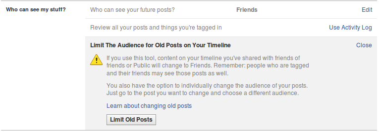
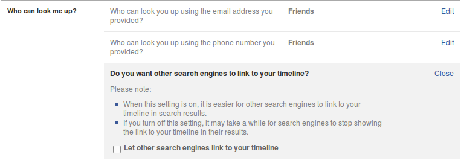
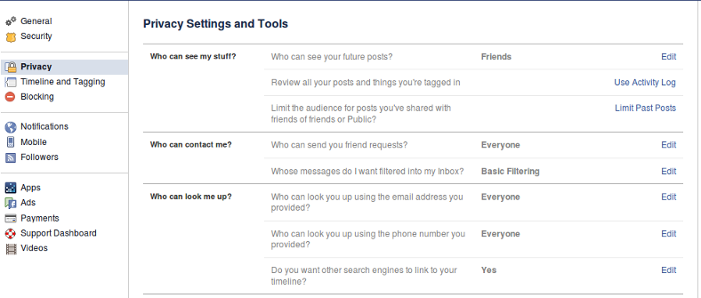

# How to control access to your personal details?
## Getting started with Facebook privacy tools

Learn to control access to your personal details on Facebook.

## Control access to personal information

# Step 1. Open Facebook privacy settings
 To edit your Facebook Privacy Settings, click on the small arrow beside Home in the top right-hand corner and select Settings.

 
# Step 2. Choose "Privacy"
 This will take you to the Settings menu. On the left-hand side, choose Privacy.

 

# Step 3. Choose who can see your stuff
The first option here creates a default rule for your future status updates: Who can see your future posts?. Here, you can choose between making them available to the entire public, your Facebook friends, yourself only, or a custom group which you can determine.
 
# You can also change this for individual posts
Note that you can also change this for individual status updates, so that you can decide which ones are public, which ones are for friends or which ones are for a specific group.
 
# Everything you post is recorded and owned by Facebook
It's also worth noting, though, that everything you post is recorded by Facebook (including when you select Only Me) and can be handed over by them to third parties.
 
# Step 4. Review posts you are tagged in
The second option allows you to review the posts which other Facebook users have tagged you in. To see this, click on Use Activity Log.

 
# Step 5. Restrict previous public posts
The third option allows you to restrict access to previous status updates of yours which may have been public. Note, however, the limitation that individuals you tagged and their friends will still be able to see this content.

 
# Step 6. Control who can contact you
In this section, you can decide who is able to send you a friend request. This is not particularly important in terms of information security, since in the end, it is still you who decides who to accept as a friend, and you should always exercise caution and avoid adding people who are unknown or untrusted.
<br.
If you want to change this setting, click Edit.
 
# Step 7. Filter messages
Whose messages do I want filtered into my inbox?: Facebook allows you to filter the messages you receive into two folders: Inbox and Other.
 
# Select filtering method
Here you can choose between Basic Filtering, which is more permissive of messages from people who are not on your friend list, and Strict Filtering, which is less permissive.

 
# Step 8. Control who can look you up
Here, you can limit the ease with which people can look you up by knowing your phone number or e-mail address (although this is still technically possible), as well as limiting people's ability to find your Facebook page via search engines.
 
# Step 8. Control who can look you up
The default settings make it as easy as possible for individuals to find you this way, including possible adversaries.
 
# Step 8. Control who can look you up
Click Edit on the first two options and ensure that only Friends can search for you by your e-mail address and phone number. For the third option, click Edit and uncheck the box which says Let other search engines link to your timeline.

## Learn how to

- [Control access to personal information on your Facebook profile](en/topics/practice-4-safe-social-networks/2-access-personal-details/3-learn.md)

## Test you social networking knowledge!

## Next

---
- en/topics/understand-4-digisec/0-getting-started/1-1-intro.md: Intro to digital security
- en/topics/practice-1-emergencies/2-account-hijacked/1-1-intro.md: What to do if your social media account has been hijacked
---
See also:
- Tactical Technology Collective: [Security in a Box](https://securityinabox.org)
- [Zen and the art of making Tech Work for you](https://gendersec.tacticaltech.org/wiki/index.php/Complete_manual)

